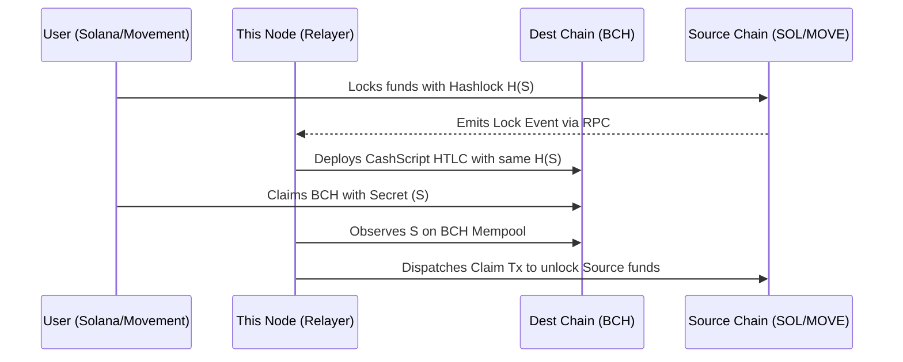

# Intents-Swaps: Cross-Chain Reference Resolver Node

[](../docs/reviewers-guide/01-protocol-overview.md)
[](#license)

This repository contains the **Node.js Reference Implementation of a Decentralized Resolver (Solver)** engine responsible for facilitating **Cross-Chain Atomic Swaps** between Bitcoin Cash and EVM/Solana/Movement architectures.

### Related Repositories
This is the off-chain engine. It actively monitors and interacts with:
* **[contracts-bch-crosschain](../contracts-bch-crosschain)**: The Bitcoin Cash Target-Chain CashScript contracts.
* **[contracts-solana](../contracts-solana)**: The Solana Target-Chain Anchor programs.
* **[contract-movement-cross-chain](../contract-movement-cross-chain)**: The Movement Target-Chain MoveVM contracts.

## Architecture

In an Intent-based protocol, the independent Decentralized Resolver is the core actor handling the heavy lifting. The user simply expresses an intent (e.g., "I will lock my Solana USDC if someone gives me Bitcoin Cash"). The Resolver monitors these intents, provides the opposite-chain liquidity, and manages the claim lifecycle.

### Execution Flow (Cross-Chain)



### Core Responsibilities
1. **Event Polling**: Continuously monitors Solana PDAs and Movement Escrow Modules for new `hashlock` commitments.
2. **Counter-Funding (Maker)**: Once a valid source lock is detected, the Resolver deploys a CashScript HTLC on Bitcoin Cash directed to the user's BCH address.
3. **Cross-Chain Synchronization (Claiming)**: When the user claims the BCH, the Resolver detects the revealed Secret (`S`) on the BCH blockchain and immediately submits a transaction to the source chain (Solana/Movement) to unlock their profit.

### Security & Review Focus
Reviewers examining this repository should focus on:
* **The Polling Engine**: Validate that the Resolver correctly parses blockchain events without race conditions, especially checking that `secret` exposures result in immediate claim dispatching.
* **Timelock Verification**: The Resolver *must* mathematically verify that the User's timelock `T` provides a sufficient buffer over the Resolver's local timelock `T/2` before committing the counter-liquidity.

---

### Navigation
* 📖 Read the detailed **[Atomic Swaps Reviewer Guide](../docs/reviewers-guide/02-cross-chain-atomic-swaps.md)** for sequence diagrams.
* 💻 Run locally: `npm run dev`

## Prerequisites
1. **Node.js**: v18+ installed.
2. **Funds**:
   - **BCH Chipnet**: Use a faucet (e.g. `tbch.googol.cash`) to fund the wallet generated in `.env` (or let `mainnet-js` auto-generate).
   - **Solana Devnet**: Use `solana airdrop 2` to fund the Relayer's keypair.

## Quick Start (Clone to Test)

```bash
git clone https://github.com/Intents-Swaps/bch-solana-relayer.git
cd bch-solana-relayer
npm install
cp .env.example .env         # Configure keys (see below)
npm run test:setup            # Generate user wallets + fund them
npm run test:bch-to-sol       # Run BCH → SOL E2E test
npm run test:sol-to-bch       # Run SOL → BCH E2E test
```

## 1. Build Verification

```bash
npm run build
# or just check types
npx tsc --noEmit
```

## 2. Environment Setup

Copy the example `.env` and configure your relayer keys:

```bash
cp .env.example .env
```

Required variables in `.env`:
| Variable | Description |
|----------|-------------|
| `BCH_PRIVATE_KEY_WIF` | Relayer's BCH wallet (WIF format, Chipnet) |
| `SOLANA_PRIVATE_KEY` | Relayer's Solana keypair (JSON array of bytes) |
| `MOVEMENT_PRIVATE_KEY` | Relayer's Movement private key (hex) |
| `SOLANA_RPC_URL` | Solana RPC (default: `https://api.devnet.solana.com`) |

> **Tip**: Run `npm run test:setup` to auto-generate keys and fund wallets if starting fresh.

## 3. Running the Relayer

```bash
npm run dev
```

The server starts on port `3004` (default). Endpoints:
- `GET /health` — Service status and wallet addresses
- `GET /orders` — Active and completed intents
- `GET /solver` — Solver dashboard (balances, financials, all intents)
- `POST /swap/bch-to-solana` — Initiate BCH → SOL swap
- `POST /swap/solana-to-bch` — Initiate SOL → BCH swap
- `POST /swap/bch-to-move` — Initiate BCH → Movement swap
- `POST /swap/move-to-bch` — Initiate Movement → BCH swap
- `POST /claim` — Reveal secret to trigger claim

## 4. End-to-End Tests

The project includes automated E2E tests that run full HTLC atomic swap lifecycles on live testnets (BCH Chipnet + Solana Devnet).

### Prerequisites

1. **Fund the relayer wallet** with BCH Chipnet and Solana Devnet tokens
2. **Run the setup script** to generate test user wallets and fund them:

```bash
npm run test:setup
```

This creates a `user_keys.json` (gitignored) with test user wallets for BCH, Solana, and Movement. It also auto-funds the user from the relayer if the relayer has sufficient balance.

### Test 1: BCH → Solana (User sells BCH, receives SOL)

```bash
npm run test:bch-to-sol
```

**What it does:**
1. User generates a secret `S` and computes `H = sha256(S)`
2. User locks 10,000 sats in a CashScript HTLC on BCH Chipnet
3. Embedded relayer detects the lock via Electrum and creates a Solana escrow
4. User claims SOL from the escrow by revealing `S`
5. ✅ Test passes when the Solana claim transaction succeeds

**Expected output:**
```
🚀 Starting Integration Test: BCH (User) -> SOL (User) [Embedded Relayer]
   ✅ BCH Locked! Contract: bchtest:p...
   ✅ Relayer Accepted Intent: bch_sol_...
   ✅ Escrow found on Solana!
   ✅ Claimed SOL! Tx: <solana_tx_hash>
   🎉 E2E Test Passed (BCH -> SOL)
```

### Test 2: Solana → BCH (User sells SOL, receives BCH)

```bash
npm run test:sol-to-bch
```

**What it does:**
1. User generates a secret `S` and computes `H = sha256(S)`
2. User locks 0.01 SOL in an Anchor HTLC escrow on Solana Devnet
3. Embedded relayer verifies the Solana escrow on-chain and deploys a CashScript HTLC on BCH
4. User claims BCH from the HTLC by revealing `S`
5. ✅ Test passes when the BCH claim transaction succeeds

**Expected output:**
```
🚀 Starting Integration Test: SOL (User) -> BCH (User) [Embedded Relayer]
   ✅ SOL Locked! PDA: <escrow_pda>
   ✅ Relayer Accepted Intent: sol_bch_...
   ✅ Relayer Locked BCH!
   ✅ Claimed BCH! Tx: <bch_tx_hash>
   🎉 E2E Test Passed (SOL -> BCH)
```

### Other Test Commands

| Command | Description |
|---------|-------------|
| `npm run test:balances` | Check BCH/SOL/MOVE/USDC balances for relayer and user |
| `npm run test:independent` | BCH ↔ Movement direct HTLC lock+claim (no relayer) |
| `npm run test:usdc` | USDC swap flows across chains |

## Configuration

---

## Future-Proofing: The 2026 STARK Upgrade

This node currently functions as a solitary hot-wallet operating standard HTLCs. To scale the network and eliminate the "Free Option Problem" for Resolvers, the 2026 Roadmap shifts this architecture to **Triton VM STARKs**. 

Future releases of the Resolver Node will:
1. Operate within a **Threshold Signature Scheme (TSS)** (e.g., a 3-of-5 MPC network) to secure the Resolver's cross-chain inventory.
2. Deposit target funds directly to the user (bypassing HTLCs).
3. Automatically compute and transmit **zk-STARK proofs** to the origin chain to instantly unlock the user's initial deposit, providing an entirely asynchronous execution environment.

---

## 📜 License

**Copyright (c) 2026 Intents-Swaps. All Rights Reserved.**
This software and associated documentation files are proprietary and confidential. No part of this repository may be copied, reproduced, distributed, or modified without explicit written permission.

*Part of the Intents Swap Protocol Ecosystem — Bringing Intent-based DeFi to Bitcoin Cash.*
